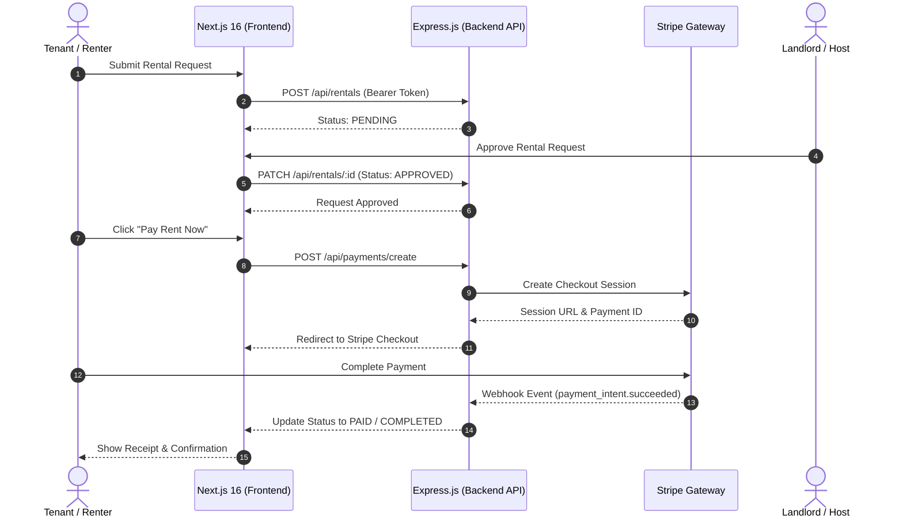

# 🏠 RentNest — Modern Property Rental & Management Platform

[](https://nextjs.org/)
[](https://react.dev/)
[](https://www.typescriptlang.org/)
[](https://tailwindcss.com/)
[](https://stripe.com/)
[](https://rent-nest-gules-two.vercel.app)

> **Find, Rent, and Manage Properties Effortlessly.**  
> RentNest is a full-stack, enterprise-grade rental property marketplace designed to streamline housing search, rental requests, landlord management, automated payment processing via Stripe, and administrative oversight.

---

## 🔗 Quick Links & Repositories

| Portal / Codebase | Link / URL |
| :--- | :--- |
| 🌐 **Live Web Application** | [rent-nest-gules-two.vercel.app](https://rent-nest-gules-two.vercel.app) |
| 🖥️ **Frontend Repository** | [github.com/Sohag-Ali/RentNest_Frontend](https://github.com/Sohag-Ali/RentNest_Frontend.git) |
| ⚙️ **Backend Repository** | [github.com/Sohag-Ali/RentNest_Backend](https://github.com/Sohag-Ali/RentNest_Backend.git) |
| 📡 **Production API Server** | `https://rentnest-backend-ezd1.onrender.com` |

---

## 🔑 Demo Accounts for Quick Review

Recruiters and evaluators can instantly explore all features across different user roles using the built-in 1-click login buttons or credentials below:

| Role | Email | Password | Access Capabilities |
| :--- | :--- | :--- | :--- |
| **👤 Tenant** | `tenant@gmail.com` | `Tenant@123` | Property browsing, request submission, Stripe checkout, payment history, review writing. |
| **🏠 Landlord** | `landload1@gmail.com` | `Landlord@123` | Listing creation & editing, incoming booking approval/rejection, earnings & tenant review management. |
| **🛡️ Admin** | `admin@gmail.com` | `Admin@123` | System analytics charts, user management (active/banned), property/category controls, global rental tracking. |

---

## 📖 Table of Contents

- [Executive Summary](#-executive-summary)
- [Key Features](#-key-features)
  - [1. Tenant Portal](#1-tenant-portal)
  - [2. Landlord / Host Portal](#2-landlord--host-portal)
  - [3. Admin Control Panel](#3-admin-control-panel)
  - [4. Authentication & Security](#4-authentication--security)
- [System Architecture & Flow](#-system-architecture--flow)
- [Tech Stack](#-tech-stack)
- [Project Structure](#-project-structure)
- [Getting Started & Local Setup](#-getting-started--local-setup)
- [Environment Configuration](#-environment-configuration)
- [API Endpoints Reference](#-api-endpoints-reference)
- [Engineering Highlights](#-engineering-highlights)
- [Author & Contact](#-author--contact)

---

## 💡 Executive Summary

Finding standard rental accommodations often involves fragmented communication, hidden costs, and insecure cash-based transactions. **RentNest** addresses these challenges by offering a unified marketplace for three primary stakeholders: **Tenants**, **Landlords**, and **Platform Administrators**.

Built on **Next.js 16 (App Router)** and **React 19**, RentNest utilizes **Server Actions**, **TanStack Query v5**, **Stripe API**, and **JWT HTTP-only Cookie Authentication** to deliver a responsive, accessible, and secure user experience.

---

## ✨ Key Features

### 1. Tenant Portal
- **Advanced Multi-Criteria Search & Filter:** Filter properties by title, category, city/location, price range, bedroom count, bathroom count, and real-time availability status.
- **Interactive Image Galleries & Details:** Detailed property view with photo galleries, verified landlord badges, property specs (year built, lease terms, pet policy, parking), and location details.
- **Rental Request Lifecycle:** Submit rental requests with custom move-in dates and message notes to property owners.
- **Stripe Payments & Electronic Receipts:** Pay rent seamlessly for approved bookings using Stripe Checkout. Download or view detailed payment receipts.
- **Verified Reviews & Star Ratings:** Leave structured reviews and star ratings for properties after a rental request is completed, with capabilities to edit or delete submitted feedback.
- **Wishlist & Saved Properties:** Bookmark properties for quick retrieval.

### 2. Landlord / Host Portal
- **Property Listing Management (CRUD):** Add, update, or archive rental property listings with multi-image upload, category tagging, dynamic pricing, and feature highlights.
- **Booking & Request Approval Workflow:** Manage pending rental requests with `Approve` or `Reject` actions, updating status in real-time.
- **Earnings & Financial Overview:** Track total rental earnings, active bookings, and upcoming payments.
- **Tenant Feedback Monitoring:** View all ratings and feedback left by tenants across owned property listings.

### 3. Admin Control Panel
- **System Dashboard Analytics:** Visual data insights powered by Recharts (platform revenue trends, total active users, property distribution, rental statistics).
- **User Management & Moderation:** View all registered accounts, switch roles, and toggle user account statuses (`Active`, `Inactive`, `Banned`).
- **Category & Taxonomy Controls:** Create, edit, and categorize rental property types (e.g., Apartments, Luxury Villas, Studio Flats, Commercial Spaces).
- **Global Property & Rental Auditing:** Monitor and manage platform-wide listings and rental transactions.

### 4. Authentication & Security
- **JWT HTTP-Only Cookies:** Dual-token strategy (`accessToken` + `refreshToken`) stored securely in HTTP-only cookies to prevent XSS attacks.
- **Google OAuth 2.0 Integration:** Quick sign-in using Google accounts alongside standard Email & Password registration.
- **Role-Based Access Control (RBAC):** Middleware-backed route protection for `/dashboard/admin`, `/dashboard/landlord`, and `/dashboard/tenant`.
- **System Theme Engine:** Adaptive Light/Dark mode implementation with system preference sync via `next-themes`.

---

## 🏗 System Architecture & Flow



---

## 🛠 Tech Stack

### Frontend Architecture
| Layer | Technology | Description |
| :--- | :--- | :--- |
| **Framework** | [Next.js 16.2](https://nextjs.org/) | App Router with Server Actions & Dynamic SSR |
| **Library** | [React 19](https://react.dev/) | Modern UI component composition |
| **Language** | [TypeScript 5](https://www.typescriptlang.org/) | End-to-end type safety |
| **Styling** | [Tailwind CSS v4](https://tailwindcss.com/) | Atomic CSS design system |
| **UI Components** | [shadcn/ui](https://ui.shadcn.com/) / `@base-ui/react` | Accessible headless components |
| **State & Fetching**| [TanStack Query v5](https://tanstack.com/query) | Client-side cache management |
| **Forms & Validation**| React Hook Form + Zod | Schema-driven form validation |
| **Charts & Visuals** | [Recharts](https://recharts.org/) | Analytics visualization |
| **Animations** | [Framer Motion](https://www.framer.com/motion/) | Smooth UI micro-interactions |
| **Notifications** | [Sonner](https://sonner.emilkowal.ski/) | Toast notification system |

### Backend Architecture
| Layer | Technology | Description |
| :--- | :--- | :--- |
| **Runtime** | Node.js | JavaScript runtime engine |
| **Framework** | Express.js | RESTful API backend server |
| **Security** | JSON Web Tokens (JWT) | HTTP-Only cookie auth sessions |
| **Payment Gateway** | Stripe SDK | PCI-compliant credit card processing |
| **Database** | MongoDB / Prisma | Persistent data store |
| **Hosting** | Render & Vercel | Production cloud deployment |

---

## 📁 Project Structure

```
RentNest_Frontend/
├── app/
│   ├── (authRoute)/                   # Authentication pages (Login, Register)
│   │   ├── auth/login/                # Sign-in page with 1-click demo buttons
│   │   ├── auth/register/             # Role selection & sign-up page
│   │   ├── _actions/authActions.ts    # Server actions for Auth
│   │   └── _components/               # LoginForm, RegistrationForm, GoogleLogin
│   │
│   ├── (publicRoute)/                 # Publicly accessible routes
│   │   ├── page.tsx                   # Landing page (Hero, Featured, City Explorer)
│   │   ├── properties/                # Property catalog & multi-filter search
│   │   ├── properties/[id]/           # Property detail & booking request form
│   │   ├── about/                     # About Us section
│   │   └── contact/                   # Contact support form
│   │
│   └── (dashboardRoute)/              # Protected Role Dashboards
│       └── dashboard/
│           ├── admin/                 # Platform Analytics, Users, Categories, Rentals
│           ├── landlord/              # Property CRUD, Incoming Requests, Earnings
│           ├── tenant/                # My Bookings, Stripe Payments, Receipts, Reviews
│           └── settings/              # Account Profile & Password Management
│
├── components/                        # Reusable React components
│   ├── hero/                          # Hero banner components
│   ├── home/                          # Home page dynamic sections
│   ├── properties/                    # Property listing cards & filter toolbars
│   ├── property-details/              # Image galleries, specs table, booking card
│   ├── property-form/                 # Property creation/edit form wizard
│   ├── reviews/                       # Star rating modals & review lists
│   ├── dashboard/                     # Sidebar, top navigation, statistics widgets
│   └── ui/                            # Primitive UI components (buttons, dialogs, inputs)
│
├── services/                          # Data fetching & service abstractions
├── hooks/                             # Custom React hooks (useCities, useAuth, etc.)
├── schemas/                           # Zod validation schemas
├── types/                             # TypeScript interfaces & types
└── public/                            # Static images, icons, and assets
```

---

## 🚀 Getting Started & Local Setup

Follow these steps to run the application locally on your machine.

### Prerequisites
- **Node.js**: `>= 20.x`
- **npm** or **pnpm** or **yarn**

### 1. Clone the Repositories

```bash
# Clone Frontend
git clone https://github.com/Sohag-Ali/RentNest_Frontend.git
cd RentNest_Frontend
```

```bash
# Clone Backend (in a separate terminal)
git clone https://github.com/Sohag-Ali/RentNest_Backend.git
cd RentNest_Backend
```

### 2. Install Dependencies

**Frontend:**
```bash
npm install
```

**Backend:**
```bash
npm install
```

### 3. Configure Environment Variables

Create a `.env.local` file in the root of `RentNest_Frontend` (see [Environment Configuration](#-environment-configuration)).

### 4. Start Development Servers

**Start Backend API:**
```bash
npm run dev
# Server running at http://localhost:5000 (or specified port)
```

**Start Frontend Application:**
```bash
npm run dev
# App running at http://localhost:3000
```

Open [http://localhost:3000](http://localhost:3000) in your browser.

---

## 🔑 Environment Configuration

Create a `.env.local` file in the `RentNest_Frontend` directory:

```env
# Backend API Base URLs
BACKEND_API_URL=https://rentnest-backend-ezd1.onrender.com
NEXT_PUBLIC_BACKEND_API_URL=https://rentnest-backend-ezd1.onrender.com
NEXT_PUBLIC_API_URL=https://rentnest-backend-ezd1.onrender.com

# Google OAuth Client ID
NEXT_PUBLIC_GOOGLE_CLIENT_ID=your_google_client_id_here

# JWT Secret Keys (Must match backend configuration)
JWT_ACCESS_SECRET=your_access_token_secret
JWT_REFRESH_SECRET=your_refresh_token_secret
JWT_ACCESS_EXPIRATION=1d
JWT_REFRESH_EXPIRATION=7d

# Stripe Webhook Secret
STRIPE_WEBHOOK_SECRET=your_stripe_webhook_secret
```

> [!WARNING]
> Never commit confidential API keys or secret tokens to public git repositories.

---

## 📡 API Endpoints Reference

The backend service handles RESTful HTTP requests under `/api`:

### 🔐 Authentication
- `POST /api/auth/register` — Register a new account (Tenant or Landlord).
- `POST /api/auth/login` — Authenticate user and issue HTTP-only cookies.
- `GET /api/auth/me` — Retrieve profile info of currently logged-in user.
- `PATCH /api/auth/me` — Update user profile details.
- `POST /api/auth/change-password` — Change account password.

### 🏠 Properties
- `GET /api/properties` — Fetch paginated list of properties with filter parameters.
- `GET /api/properties/:id` — Retrieve property details by ID.
- `POST /api/properties` — Create a new property listing (Landlord only).
- `PATCH /api/properties/:id` — Update property listing details.
- `DELETE /api/properties/:id` — Delete/archive property listing.

### 📅 Rental Requests & Bookings
- `POST /api/rentals` — Submit a rental request (Tenant).
- `GET /api/rentals` — List rental requests for current user.
- `PATCH /api/rentals/:id` — Approve or Reject rental request (Landlord/Admin).

### 💳 Payments & Checkout
- `POST /api/payments/create` — Initialize Stripe Checkout session for approved request.
- `GET /api/payments` — Retrieve payment transaction history.
- `GET /api/payments/:id` — Get detailed payment receipt.

### ⭐ Reviews & Feedback
- `POST /api/reviews` — Submit review & star rating for a completed rental.
- `GET /api/reviews` — Get public reviews for a specific property.
- `PATCH /api/reviews/:id` — Update an existing review.
- `DELETE /api/reviews/:id` — Delete a review.

---

## ⚡ Engineering Highlights

1. **Next.js 16 Server Actions:** Form submissions and authentication requests use Next.js Server Actions for type-safe server mutations with low latency.
2. **Robust Security Strategy:** Dual JWT access and refresh token pattern backed by secure, `SameSite=Lax`, `httpOnly` cookies.
3. **Decoupled Architecture:** Separation of UI components, server action handlers, and REST service interfaces to ensure clean maintainability and scalability.
4. **Optimistic UI & Cache Management:** Integrated TanStack Query v5 to enable seamless background refetching and cached queries across property lists and user dashboards.
5. **Modern Design System:** Built using Tailwind CSS v4 custom variables, glassmorphism UI elements, dark mode support, and framer-motion page transitions.

---

## 👨‍💻 Author & Contact

**Sohag Ali**  
Full Stack Developer  

- 🌐 **Live Website:** [rent-nest-gules-two.vercel.app](https://rent-nest-gules-two.vercel.app)
- 🐙 **GitHub Profile:** [@Sohag-Ali](https://github.com/Sohag-Ali)
- 📦 **Frontend Repo:** [RentNest_Frontend](https://github.com/Sohag-Ali/RentNest_Frontend.git)
- ⚙️ **Backend Repo:** [RentNest_Backend](https://github.com/Sohag-Ali/RentNest_Backend.git)

---

<div align="center">
  <sub>Designed & Developed with ❤️ by <strong>Sohag Ali</strong></sub>
</div>
